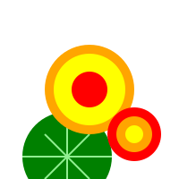

<link href="logo/style.css" rel="stylesheet" />

<a href="">

<h3>риски<b>по</b></h3>
nasturtium

</a>

# Object            

- property1
- property2

# Alerts

| Item              | In Stock | Price |
|:------------------|:---------|-------|
| Python Hat        | True     | 23.99 |
| SQL Hat           | True     | 23.99 |
| Codecademy Tee    | False    | 19.99 |
| Codecademy Hoodie | False    | 42.99 |
